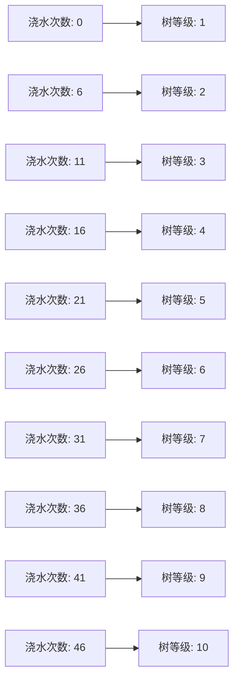
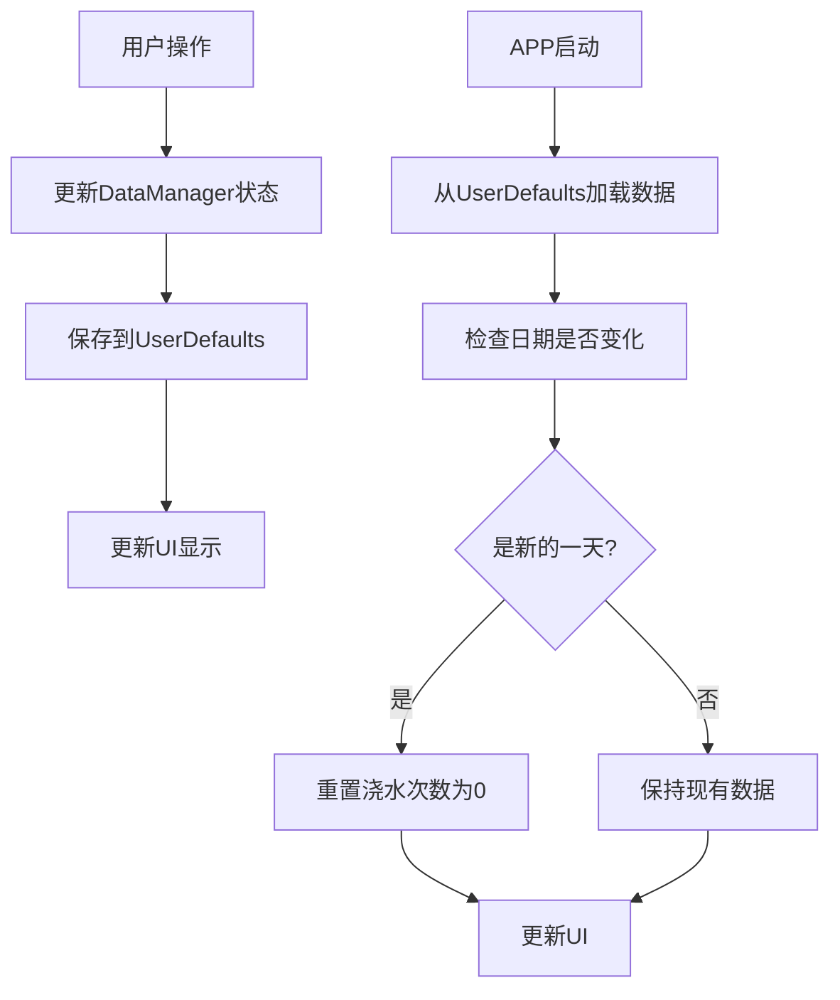
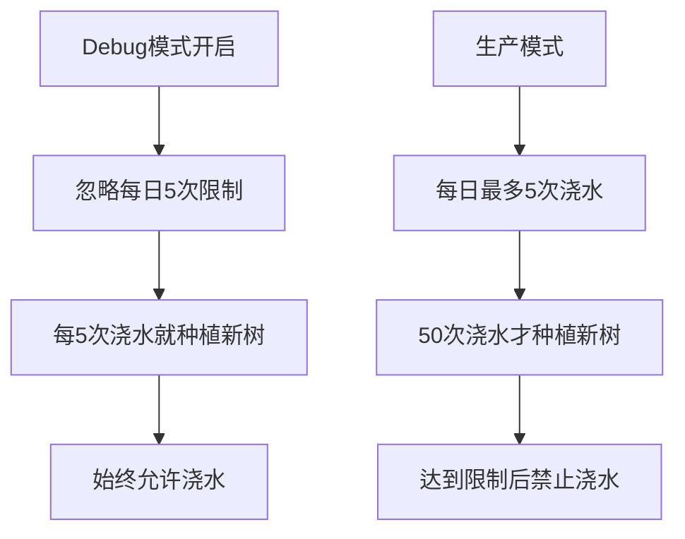

# TreeToForest 游戏玩法流程图

## 核心玩法机制

```mermaid
graph TD
    A[用户打开APP] --> B[检查每日浇水次数]
    B --> C{今日是否已浇水5次?}
    C -->|是| D[显示"每日限制已达"提示]
    C -->|否| E[显示浇水按钮]
    
    E --> F[用户点击浇水]
    F --> G[隐藏浇水按钮]
    G --> H[播放浇水动画]
    H --> I[动画完成回调]
    I --> J[增加浇水次数]
    J --> K[触发树闪烁动画]
    K --> L[重新显示浇水按钮]
    
    L --> M{浇水次数达到50次?}
    M -->|是| N[在沙漠中种植一棵新树]
    M -->|否| O[更新树等级显示]
    
    N --> P[保存新树位置到本地]
    O --> Q[保存浇水次数]
    P --> Q
    Q --> R[等待下次浇水]
    
    D --> S[2秒后自动隐藏提示]
    S --> R
    
    T[用户点击问号按钮] --> U[显示环保信息弹窗]
    U --> V[用户点击"I know it"]
    V --> W[关闭弹窗]
    W --> R
    
    X[用户点击问号按钮] --> U
    U --> Y[用户点击浇水]
    Y --> Z[关闭弹窗并开始浇水流程]
    Z --> F
```

## 树等级系统



## 数据持久化流程



## Debug模式特殊逻辑



## 核心问题分析

### 1. 状态管理混乱
- UI状态（动画、弹窗）与业务状态（浇水次数、树等级）混在一起
- 没有清晰的状态层次结构

### 2. 魔法数字问题
- 硬编码的5（每日限制）、50（种植新树阈值）
- 应该统一到配置文件中

### 3. 职责不清
- DataManager既管业务逻辑又管UI状态
- 应该分离为不同的管理器

### 4. 错误处理缺失
- 没有网络错误、存储失败等异常情况的处理
- 用户体验不够健壮

